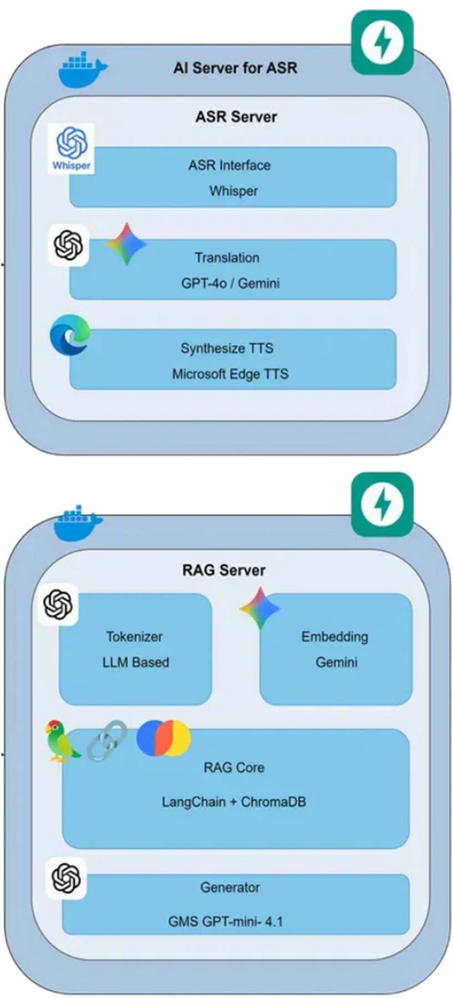
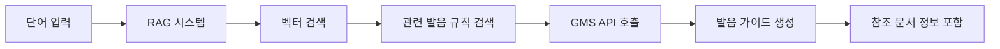
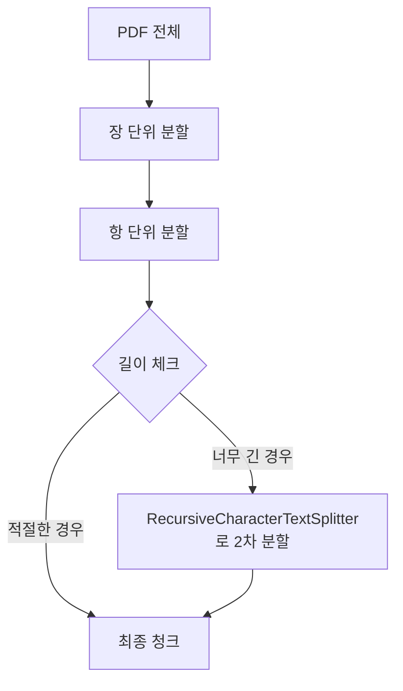
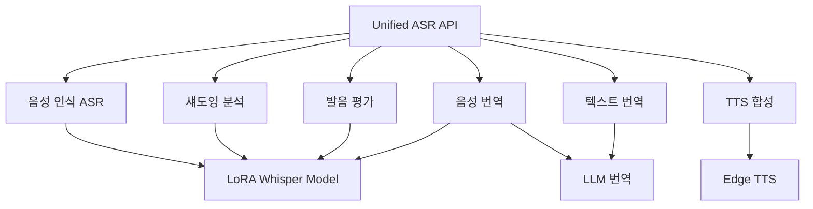
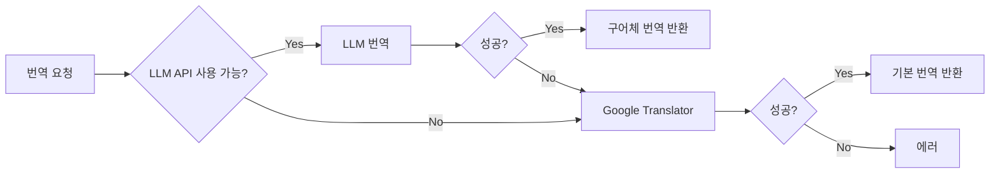
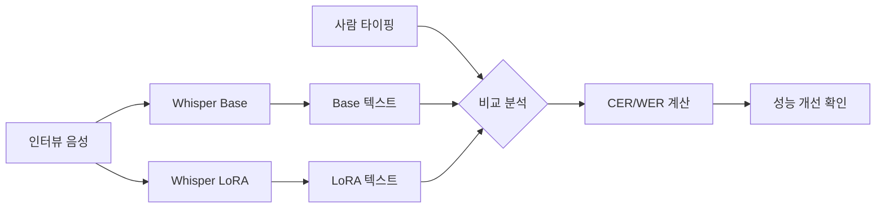
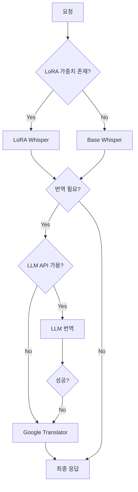

# 다가가 AI 서비스
## AI 전체 아키텍처



## 🏗️ RAG 서버 아키텍처 특징

### 1. **듀얼 AI API 전략**

시스템은 두 가지 다른 목적으로 AI API를 호출합니다:

#### 단어 분리 전용
- **모델**: 환경 변수로 설정
- **엔드포인트**: 환경 변수로 설정
- **용도**: 한국어 문장을 어절 단위로 분리
- **특징**: 
  - Temperature 0으로 결정론적 출력
  - 최대 256 토큰으로 제한
  - 간단한 규칙 기반 프롬프트

#### `call_api_for_pronunciation()` - 발음 가이드 전용
- **모델**: 고정 `gemini-2.5-flash`
- **엔드포인트**: Gemini API 직접 호출
- **용도**: RAG 기반 발음 가이드 생성
- **특징**:
  - Temperature 0.1로 약간의 창의성 허용
  - 최대 2048 토큰으로 긴 응답 지원
  - RAG 컨텍스트를 포함한 복잡한 프롬프트 처리

### 2. **서버 라이프사이클 관리**

```python
@asynccontextmanager
async def lifespan(app: FastAPI):
    # Startup: RAG 시스템 초기화
    initialize_rag_system()
    yield
    # Shutdown: 정리 작업
```

**핵심 로직**:
- 서버 시작 시 RAG 시스템을 **한 번만** 초기화
- 초기화 실패 시에도 서버는 계속 실행 (Fallback 모드)
- 임베딩 모델과 벡터 DB를 미리 로드하여 첫 요청 지연 최소화

### 3. **단어 분리 로직**

#### 입력 처리
```
"아이가 학교에 갑니다." → ["아이가", "학교에", "갑니다."]
```

#### 핵심 규칙
1. **어절 단위 분리**: 띄어쓰기 기준으로만 분리
2. **형태소 분해 금지**: "좋아해요"를 "좋아", "해요"로 나누지 않음
3. **구두점 처리**:
   - 마침표(.), 물음표(?), 느낌표(!)는 어절에 그대로 붙임
   - 쉼표는 출력 구분자로만 사용
4. **순서 보존**: 입력 순서 절대 변경 안 함

#### 파싱 메커니즘
```python
words = [word.strip() for word in response_text.split(",") if word.strip()]
```
- AI 응답을 쉼표로 split
- 공백 제거 및 빈 문자열 필터링

### 4. **RAG 기반 발음 가이드 생성**

#### 워크플로우



#### 핵심 특징

1. **RAG 통합**:
   - 한국어 발음 규칙 문서를 벡터 DB에서 검색
   - 검색된 컨텍스트를 GMS 프롬프트에 추가

2. **함수 주입 패턴**:
   ```python
   pronunciation_guide, referenced_docs = generate_pronunciation_with_rag(
       words=request.words,
       ai_api_call_func=call_gms_ai_for_pronunciation  # 함수를 인자로 전달
   )
   ```
   - RAG 모듈에 AI 호출 함수를 주입
   - 의존성 역전으로 모듈 간 결합도 낮춤

3. **메타데이터 반환**:
   ```python
   referenced_rules = [
       ReferencedRule(**doc) for doc in referenced_docs
   ]
   ```
   - 발음 가이드와 함께 참조한 규칙 문서 정보 제공
   - 장(chapter), 조(article), 페이지 범위, 태그 등 포함
   - 사용자가 발음 규칙의 근거를 확인 가능

---

## 📚 RAG 시스템 상세 아키텍처

### 1. **데이터 소스: 한국어 표준 발음법 문서**

- **파일**: `Korean_guide.pdf` (한국어 표준 발음법 공식 문서)
- **구조**: 장(章) → 항(項) → 예시 및 설명
- **크기**: PDF 형식으로 약 50~100페이지 분량
- **저장소**: Chroma 벡터 DB (`./chroma_db`)

### 2. **PDF 문서 처리 및 청킹 전략**

#### 구조 인식 청킹 (Structure-Aware Chunking)

일반적인 고정 길이 청킹 대신, **문서의 논리적 구조를 보존**하는 방식 사용:

```python
# 청킹 파라미터
CHUNK_SIZE = 1000
CHUNK_OVERLAP = 150
TOP_K_RESULTS = 4
```

#### 3단계 계층적 분할



**1단계: 장(章) 분할**
- 정규식: `제\s*\d+\s*장\s*...`
- 예: "제2장 음의 길이", "제3장 음의 동화"

**2단계: 항(項) 분할**
- 정규식: `제\s*\d+\s*항(?:\s*\([^)]+\))?\s*...`
- 예: "제7항", "제5항 (연음화)"

**3단계: 길이 제어**
- 항이 2000자 이상이면 RecursiveCharacterTextSplitter로 추가 분할
- 메타데이터는 보존

#### 페이지 마커 시스템

```python
# 각 페이지마다 마커 삽입
[PAGE=23]
제7항 연음화 규칙
받침이 모음으로 시작하는 어미...
```

- 청크가 여러 페이지에 걸쳐 있어도 page_start/page_end 자동 추적
- 사용자에게 정확한 출처 제공

### 3. **발음 현상 자동 태깅**

8가지 주요 발음 현상을 자동으로 감지하여 태깅:

| 발음 현상 | 키워드 | 트리거 패턴 | 예시 |
|---------|--------|------------|------|
| 연음 | 연음, 이어, 받침, 모음 | 받침+모음 | 집에→지베 |
| 된소리되기 | 된소리, 경음화 | 받침+ㄱㄷㅂㅅㅈ | 학교→학꾜 |
| 비음화 | 비음화, 비음, ㄴ, ㅁ | ㄱㄷㅂ+ㄴㅁ | 국물→궁물 |
| 구개음화 | 구개음화, 디→지, 티→치 | ㄷ/ㅌ+이 | 굳이→구지 |
| 유음화 | 유음화, ㄴ, ㄹ | ㄴ+ㄹ, ㄹ+ㄴ | 난로→날로 |
| 격음화 | 격음화, 거센소리, ㅎ | 자음+ㅎ | 좋다→조타 |
| 두음법칙 | 두음, 어두, 첫소리 | 어두 ㄹ/ㄴ | 노동→노동 |
| ㅎ탈락 | ㅎ탈락, 탈락, ㅎ | ㅎ+모음 | 좋아→조아 |

```python
# 자동 감지 예시
text = "제7항 연음 규칙: 받침이 모음으로..."
tags = ["연음", "liaison", "음절경계"]
triggers = ["받침+모음", "종성+초성 ㅇ"]
```

### 4. **임베딩 모델: Gemini Embedding**

#### 커스텀 임베딩 클래스

```python
class GMSEmbeddings(Embeddings):
    model_name = "models/gemini-embedding-001"
    api_url = ""
```

**특징**:
- **벡터 차원**: 768차원 (Gemini Embedding 표준)
- **API 형식**: Gemini API 스펙 준수
- **헤더**: `x-goog-api-key` 사용
- **페이로드**: `content.parts[0].text` 형식

#### 임베딩 모델 변경 감지

```python
# 마커 파일: ./chroma_db/.embedding_model
current_model_marker = ""
```

- 임베딩 모델이 변경되면 자동으로 벡터 DB 재생성
- 호환성 문제 방지

### 5. **벡터 검색 전략**

#### 멀티-쿼리 검색 (Multi-Query Retrieval)

단일 쿼리 대신 **여러 변형 쿼리**로 검색하여 재현율(Recall) 향상:

```python
def _build_queries(words: List[str]) -> List[str]:
    base = "한국어 표준 발음 규정 연음 된소리 비음화 구개음화 유음화 격음화 두음법칙 ㅎ탈락"
    
    queries = []
    # 각 단어별 쿼리
    for w in words:
        queries.append(f"{base} {w}")
    
    # 전체 문맥 쿼리
    queries.append(f"{base} " + " ".join(words))
    
    return queries
```

**예시**:
```
입력 단어: ["집에", "가요"]

생성 쿼리:
1. "한국어 표준 발음 규정 연음 된소리... 집에"
2. "한국어 표준 발음 규정 연음 된소리... 가요"
3. "한국어 표준 발음 규정 연음 된소리... 집에 가요"
```

#### 중복 제거 및 병합

```python
# 여러 쿼리 결과를 합치되 중복 제거
seen = set()
for q in queries:
    results = vector_store.similarity_search(q, k=TOP_K_RESULTS)
    for d in results:
        key = (d.metadata["chapter"], d.metadata["article"], d.page_content[:80])
        if key not in seen:
            seen.add(key)
            merged_docs.append(d)

# 최대 6~8개 청크로 제한
merged_docs = merged_docs[:max(6, TOP_K_RESULTS * 2)]
```

#### 컨텍스트 구성

검색된 각 청크에 메타데이터 헤더를 추가:

```
[제2장 음의 길이 | 제7항 | p23-24 | tags: 연음, liaison]
받침이 모음으로 시작하는 어미나 접미사 앞에서는...

[제3장 음의 동화 | 제10항 | p28-29 | tags: 비음화, nasalization]
ㄱ, ㄷ, ㅂ이 비음 ㄴ, ㅁ 앞에서...
```

### 6. **프롬프트 엔지니어링**

#### RAG 컨텍스트 주입

```python
prompt = f"""한국어 발음 전문가입니다.
아래 {len(words)}개 단어를 실제 발음대로 한글로 표기하세요.

참고 발음 규칙:
{context[:2500]}  # 최대 2500자로 제한

핵심 규칙:
• 연음: 집에→지베, 밥을→바블, 옷이→오시
• 비음화: 국물→궁물, 닫는→단는  
• 된소리: 학교→학꾜, 먹다→먹따

입력 ({len(words)}개):
{words_str}

**중요**: 
1. 위 {len(words)}개 단어 모두에 대해 발음을 생성하세요
2. 발음 변화가 없어도 모든 단어를 출력하세요
3. 쉼표로만 구분하고 설명은 절대 쓰지 마세요

출력 ({len(words)}개, 쉼표 구분):"""
```

**핵심 전략**:
- **컨텍스트 길이 제한**: 2500자 (토큰 제한 대응)
- **Few-shot 예시**: 핵심 규칙 3가지 명시
- **출력 형식 강제**: 쉼표 구분, 설명 금지
- **개수 명시**: 입력/출력 개수를 반복적으로 강조

### 7. **응답 파싱 및 검증**

#### 견고한 파싱 로직

```python
# 1. "출력:" 이후 부분만 추출
if "출력:" in response:
    response = response.split("출력:")[-1].strip()

# 2. 쉼표로 분리
parts = [p.strip() for p in response.split(",")]

# 3. 각 부분 정제
for part in parts:
    if ":" in part:
        part = part.split(":", 1)[1].strip()  # "단어:발음" 형식 대응
    
    part = part.strip("[]\"'「」『』")  # 불필요한 기호 제거
    
    if part:
        pronunciation_guide.append(part)
```

#### 개수 불일치 처리

```python
# 길이 맞추기
while len(pronunciation_guide) < len(words):
    pronunciation_guide.append(words[len(pronunciation_guide)])

# 초과분 제거
pronunciation_guide = pronunciation_guide[:len(words)]
```

### 8. **참조 문서 메타데이터**

API 응답에 포함되는 상세 정보:

```json
{
  "referenced_rules": [
    {
      "index": 1,
      "chapter": "제2장 음의 길이",
      "article": "제7항",
      "page_start": 23,
      "page_end": 24,
      "tags": "연음, liaison, 음절경계"
    }
  ]
}
```

**활용**:
- 사용자가 발음 규칙의 근거 확인 가능
- 교육 목적으로 원본 문서 참조
- 시스템 디버깅 및 성능 분석

---

## 🔌 API 엔드포인트

### 1. `POST /api/v1/tokenize`

**요청**:
```json
{
  "text": "아이가 학교에 갑니다."
}
```

**응답**:
```json
{
  "original_text": "아이가 학교에 갑니다.",
  "words": ["아이가", "학교에", "갑니다."],
  "word_count": 3
}
```

### 2. `POST /api/v1/pronunciation-guide`

**요청**:
```json
{
  "words": ["집에", "가요"]
}
```

**응답**:
```json
{
  "words": ["집에", "가요"],
  "pronunciation_guide": ["지베", "가요"],
  "referenced_rules": [
    {
      "index": 12,
      "chapter": "제2장 음의 길이",
      "article": "제7항",
      "page_start": 23,
      "page_end": 24,
      "tags": "연음화, 자음동화"
    }
  ]
}
```


## 🧩 핵심 설계 패턴

### 1. **관심사 분리 (Separation of Concerns)**
- **`rag.py`**: API 레이어 (FastAPI 엔드포인트, 요청/응답 처리)
- **`rag_pronunciation.py`**: 비즈니스 로직 (RAG 시스템, 벡터 검색)
- AI API 호출 함수를 인자로 전달하여 모듈 간 결합도 감소

### 2. **Graceful Degradation**
```python
try:
    initialize_rag_system()
except Exception as e:
    logger.warning("Server will continue without RAG (fallback mode)")
```
- RAG 초기화 실패 시에도 서버 정상 동작
- 에러를 로그로 기록하고 계속 진행

### 3. **명시적 API 계약**
- Pydantic 모델로 요청/응답 스키마 명확히 정의
- 자동 검증 및 문서화 (FastAPI 스웨거)

### 4. **구조화된 에러 처리**
```python
if response.status_code >= 400:
    logger.error(f"GMS error status={response.status_code} body={response.text}")
    raise HTTPException(status_code=500, detail=f"GMS API error: {response.text}")
```
- 상세한 에러 로깅
- 사용자에게 명확한 에러 메시지 제공

## 🎯 핵심 강점

1. **정확성**: RAG를 통해 실제 한국어 발음 규칙 문서 참조
2. **추적 가능성**: 참조한 규칙 문서 메타데이터 제공
3. **확장성**: 모듈화된 구조로 새로운 기능 추가 용이
4. **안정성**: Fallback 모드로 부분 장애에도 서비스 유지
5. **최적화**: 서버 시작 시 RAG 시스템 사전 로드로 첫 요청 지연 최소화

---

## 🎤 Unified ASR & Translation API 아키텍처

### 개요

`unified_asr.py`는 **Whisper 기반 음성 인식(ASR)**, **다국어 번역**, **TTS(Text-to-Speech)**, **발음 평가**를 통합한 멀티모달 API 서버입니다. LoRA(Low-Rank Adaptation) 파인튜닝을 적용하여 한국어 음성 인식 성능을 최적화했습니다.

### 핵심 기능



### 1. **LoRA 기반 Whisper ASR**

#### 모델 구조

```python
# 베이스 모델 + LoRA 어댑터
WhisperForConditionalGeneration.from_pretrained("openai/whisper-small")
+ PeftModel.from_pretrained(model, "./finetuned")
→ merge_and_unload()  # LoRA 가중치 병합
```

**특징**:
- **베이스 모델**: `openai/whisper-small` (환경 변수로 변경 가능)
- **LoRA 경로**: `./finetuned/` 디렉토리
- **자동 Fallback**: LoRA 가중치 없으면 베이스 모델 사용
- **장치 자동 감지**: CUDA 사용 가능 시 GPU, 아니면 CPU

#### 초기화 로직

```python
@app.on_event("startup")
async def startup_event():
    get_asr_pipeline()  # 서버 시작 시 모델 사전 로드
```

- **Lazy Loading 방지**: 첫 요청 지연 최소화
- **메모리 효율성**: `low_cpu_mem_usage=True`
- **정밀도 제어**: GPU는 float16, CPU는 float32

#### Word-level Timestamps

```python
pipe(
    audio_file,
    return_timestamps="word",  # 단어별 타임스탬프
    chunk_length_s=30,
    batch_size=1
)
```

**결과 구조**:
```json
{
  "chunks": [
    {"text": " 안녕하세요", "timestamp": (0.0, 1.2)},
    {"text": " 저는", "timestamp": (1.2, 1.8)},
    {"text": " 학생입니다", "timestamp": (1.8, 3.0)}
  ]
}
```

### 2. **다층 번역 전략 (LLM + Fallback)**

#### 3단계 Fallback 체인



#### LLM 번역 (1차 시도)

**프롬프트 엔지니어링**:
```python
prompt = f"""다음 {source_name} 문장을 {target_name}로 번역하세요.

중요한 규칙:
1. 자연스러운 구어체로 번역 (예: "합니다" → "해요", "갑니다" → "가요")
2. 외국인 학습자가 일상 대화에서 사용할 수 있는 표현 사용
3. 의미는 정확하게 유지
4. 설명 없이 번역된 문장만 출력

입력 ({source_name}): {text}
출력:"""
```

**모델**:
- **우선**: 환경 변수 `TRANSLATION_MODEL` (예: GPT-4.1-nano)
- **API**: OpenAI 호환 형식
- **파라미터**: Temperature 0 (결정론적 출력)

#### Google Translator Fallback (2차 시도)

```python
# LLM API 실패 시 자동 전환
from deep_translator import GoogleTranslator
translator = GoogleTranslator(source="zh-CN", target="ko")
return translator.translate(text)
```

**언어 매핑**:
| 입력 | Whisper | Google Translator |
|------|---------|-------------------|
| zh-cn, zh, cn | zh | zh-CN |
| vi | vi | vi |
| ko | ko | ko |
| en | en | en |

### 3. **TTS (Text-to-Speech) - Edge TTS**

#### 언어 자동 감지

**2단계 감지 시스템**:

1. **문자 기반 감지** (1차):
   ```python
   has_chinese = any('\u4e00' <= char <= '\u9fff' for char in text)
   has_korean = any('\uac00' <= char <= '\ud7af' for char in text)
   has_japanese_hiragana = any('\u3040' <= char <= '\u309f' for char in text)
   ```

2. **langdetect 라이브러리** (2차):
   ```python
   from langdetect import detect
   detected_lang = detect(text)  # fallback to langdetect
   ```

#### 다국어 음성 지원 (15개 언어)

| 언어 | Edge TTS 음성 모델 | 성별 |
|------|-------------------|------|
| 한국어 | ko-KR-SunHiNeural | 여성 (선희) |
| 중국어 | zh-CN-XiaoxiaoNeural | 여성 (샤오샤오) |
| 베트남어 | vi-VN-HoaiMyNeural | 여성 (호아이미) |
| 영어 | en-US-JennyNeural | 여성 (제니) |
| 일본어 | ja-JP-NanamiNeural | 여성 (나나미) |
| 스페인어 | es-ES-ElviraNeural | 여성 |
| 프랑스어 | fr-FR-DeniseNeural | 여성 |
| ... | (총 15개 언어) | ... |

#### 스트리밍 생성

```python
communicate = edge_tts.Communicate(text, voice)
audio_buffer = io.BytesIO()
async for chunk in communicate.stream():
    if chunk["type"] == "audio":
        audio_buffer.write(chunk["data"])

return StreamingResponse(audio_buffer, media_type="audio/mpeg")
```

- **포맷**: MP3
- **메모리 효율**: 스트리밍으로 버퍼에 저장
- **응답 타입**: `StreamingResponse`

### 4. **발음 평가 (Pronunciation Evaluation)**

#### 평가 알고리즘

**1. Levenshtein Distance 기반 PER (Phoneme Error Rate)**

```python
# 편집 거리 계산
edit_distance = levenshtein_distance(expected, transcribed)
per = (edit_distance / len(expected)) * 100

# 발음 점수 = 100 - PER
pronunciation_score = max(0, 100 - per)
```

**2. SequenceMatcher 기반 정확도**

```python
from difflib import SequenceMatcher
accuracy = SequenceMatcher(None, expected, transcribed).ratio() * 100
```

#### 4가지 평가 지표

| 지표 | 계산 방식 | 설명 |
|------|----------|------|
| **Accuracy** | SequenceMatcher ratio | 문자 단위 일치도 (0-100%) |
| **Pronunciation** | 100 - PER | 발음 정확도 (편집 거리 기반) |
| **Fluency** | = Accuracy | 유창성 (간이 지표) |
| **Overall** | (Accuracy + Pronunciation) / 2 | 종합 점수 |

#### Pass/Fail 로직

```python
if retry_count >= 5:
    is_pass = True  # 5회 이상 재시도 시 무조건 통과
elif accuracy >= 0.0:
    is_pass = True  # 현재는 모든 시도 통과 (임계값 조정 가능)
```

**응답 예시**:
```json
{
  "transcribed_text": "집에 가요",
  "expected_text": "집에 가요",
  "scores": {
    "accuracy": 100.0,
    "pronunciation": 100.0,
    "fluency": 100.0,
    "overall": 100.0
  },
  "is_pass": true,
  "language": "ko"
}
```

### 5. **API 엔드포인트 명세**

#### 📍 `POST /api/v1/asr/transcribe`

**기능**: 한국어 음성 인식 (LoRA Whisper)

**요청**:
```
파일: audio (multipart/form-data)
파라미터:
  - language: "ko" (기본값)
  - beam_size: 5
  - vad_filter: true
  - temperature: 0.0
```

**응답**:
```json
{
  "text": "안녕하세요 저는 학생입니다",
  "language": "ko",
  "segments": [
    {
      "start": 0.0,
      "end": 3.0,
      "text": "안녕하세요 저는 학생입니다",
      "words": [
        {"word": "안녕하세요", "start": 0.0, "end": 1.2, "probability": 1.0},
        {"word": "저는", "start": 1.2, "end": 1.8, "probability": 1.0},
        {"word": "학생입니다", "start": 1.8, "end": 3.0, "probability": 1.0}
      ]
    }
  ]
}
```

#### � `POST /api/v1/asr/transcribe/word`

**기능**: 섀도잉용 단어 단위 음성 인식

**요청**:
```
파일: audio
파라미터:
  - expected_word: "집에" (선택)
  - language: "ko"
```

**응답**:
```json
{
  "transcribed_text": "집에",
  "expected_word": "집에",
  "words": [
    {"word": "집에", "start": 0.0, "end": 0.8, "probability": 1.0}
  ],
  "warning": "인식된 텍스트가 기대 단어와 다릅니다." // 불일치 시
}
```

#### 📍 `POST /api/v1/asr/evaluate/pronunciation`

**기능**: 발음 평가 (섀도잉용)

**요청**:
```
파일: audio
Form 데이터:
  - expected_text: "안녕하세요"
  - retry_count: 0
  - language: "ko"
```

**응답**: 위 "발음 평가" 섹션 참조

#### 📍 `POST /api/v1/translate/audio`

**기능**: 외국어 음성 → 한국어 번역

**요청**:
```
파일: audio (중국어/베트남어 음성)
파라미터:
  - source_language: "zh-cn" | "vi" | "auto"
```

**응답**:
```json
{
  "original_text": "我去学校",
  "original_language": "zh-cn",
  "translated_text": "저는 학교에 가요",
  "target_language": "ko"
}
```

#### 📍 `POST /api/v1/translate/text`

**기능**: 텍스트 직접 번역

**요청**:
```json
{
  "text": "我去学校",
  "source_lang": "zh-cn",
  "target_lang": "ko"
}
```

**응답**:
```json
{
  "original_text": "我去学校",
  "source_language": "zh-cn",
  "translated_text": "저는 학교에 가요",
  "target_language": "ko"
}
```

#### 📍 `POST /api/v1/tts/synthesize`

**기능**: 텍스트 → 음성 합성

**요청**:
```
Form 데이터:
  - text: "안녕하세요"
```

**응답**:
```
Content-Type: audio/mpeg
파일: tts_{detected_lang}.mp3
```


### 6. **기술 스택**

| 컴포넌트 | 기술 | 역할 |
|---------|------|------|
| **ASR** | Whisper + LoRA (PEFT) | 음성 인식 (한국어 최적화) |
| **번역** | LLM API + Google Translator | 다국어 → 한국어 번역 |
| **TTS** | Edge TTS | 15개 언어 음성 합성 |
| **발음 평가** | Levenshtein + SequenceMatcher | 편집 거리 기반 점수 |
| **프레임워크** | FastAPI + Transformers | REST API 서버 |
| **파인튜닝** | PEFT (LoRA) | 메모리 효율적 파인튜닝 |

### 7. **성능 최적화**

#### LoRA의 장점

```
기존 Full Fine-tuning:
  - 파라미터: 전체 모델 (수억 개)
  - 메모리: 매우 높음
  - 학습 시간: 오래 걸림

LoRA Fine-tuning:
  - 파라미터: 어댑터만 (수백만 개)
  - 메모리: 매우 적음 (1-2% 수준)
  - 학습 시간: 빠름
  - 병합 후 추론 속도: 동일
```

#### 메모리 최적화

```python
# 1. Low CPU Memory 모드
model = WhisperForConditionalGeneration.from_pretrained(
    BASE_MODEL_NAME,
    low_cpu_mem_usage=True  # 메모리 효율적 로딩
)

# 2. LoRA 병합
model = PeftModel.from_pretrained(model, LORA_WEIGHTS_PATH)
model.merge_and_unload()  # 병합 후 어댑터 제거 → 추론 속도 향상

# 3. 정밀도 최적화
torch_dtype = torch.float16  # GPU에서 메모리 절반, 속도 2배
```

### 8. **Whisper LoRA 파인튜닝 학습 전략**

#### 학습 목적

본 프로젝트의 Whisper 모델 파인튜닝은 **다문화 가정 구성원의 비표준 발화** 인식 성능 향상을 목표

**핵심 과제**:
- 발음이 어눌한 화자의 음성 인식 정확도 개선
- 한국어 학습자의 불완전한 발음 패턴 학습
- 실제 인터뷰 데이터의 높은 WER(Word Error Rate) 문제 해결

#### 타겟 데이터 특징

```python
# 인터뷰 음성 분석 타겟
타겟 화자: 다문화 가정 구성원 (발음 어눌)
- 나이: 중장년층 (언어 습득 어려움)
- 특징: 
  * 한국어 숙련도: 중급
  * 발음: 비표준적, 억양 불안정
  * 사용 어휘: 일상 회화 중심
  
학습 데이터 형식:
{
  "audio": "interview.m4a",
  "transcript": "사람이 직접 타이핑한 텍스트",
  "특징": "띄어쓰기, 맞춤법 불규칙"
}
```

#### 파인튜닝 전략

**1. 데이터 전처리**

```python
# a. 화자 분리 (Speaker Diarization)
- pyannote.audio 사용
- 두 명의 화자 중 "발음 어눌한 화자"만 추출
- 첫 발화자: 면접관 (표준 발음) → 제외
- 두 번째 발화자: 인터뷰 대상 → 학습 데이터

# b. 세그먼트 병합
- 짧은 발화 (5초 미만) 병합
- 최소 세그먼트 길이 확보 → 학습 안정성 향상
- 원본: 1013개 세그먼트 → 병합 후: 252개
```

**2. G2P (Grapheme-to-Phoneme) 정규화**

```python
from g2pk import G2p
g2p = G2p()

# 발음 기반 정규화
"집에" → "지베"  (연음 규칙 적용)
"학교" → "학꾜"  (된소리 규칙 적용)
"국물" → "궁물"  (비음화 규칙 적용)
```

**목적**: 
- 표기와 실제 발음의 괴리 해소
- 발음 기반 학습 강화
- CER/WER 개선

**3. 환각(Hallucination) 방지**

Whisper 모델의 고질적 문제인 환각 현상 (반복/무관한 텍스트) 방지:

```python
generate_kwargs = {
    "no_repeat_ngram_size": 3,       # 3-gram 반복 금지
    "repetition_penalty": 1.5,       # 반복 패널티
    "early_stopping": True           # 조기 종료
}

# 후처리 정규화
text = re.sub(r'(.)\\1{10,}', r'\\1', text)  # 같은 글자 10번+ 반복 제거
text = re.sub(r'MBC 뉴스.*?입니다\\.?', '', text)  # 뉴스 클리셰 제거
text = re.sub(r'구독과 좋아요.*', '', text)  # 유튜브 클리셰 제거
```

**4. 학습 파라미터**

```python
training_args = {
    "learning_rate": 1e-4,           # LoRA 권장값
    "warmup_steps": 500,             # Warm-up 단계
    "max_steps": 5000,               # 충분한 학습
    "gradient_accumulation_steps": 2,# 메모리 효율
    "eval_steps": 500,               # 주기적 평가
    "save_steps": 500,               # 체크포인트 저장
    "logging_steps": 25              # 로그 주기
}

lora_config = {
    "r": 32,                         # LoRA rank
    "lora_alpha": 64,                # 스케일링 파라미터
    "target_modules": ["q_proj", "v_proj"],  # Query, Value 매트릭스만 적용
    "lora_dropout": 0.05,            # 과적합 방지
    "bias": "none"                   # 바이어스 제외
}
```

**5. 평가 지표**

```python
from jiwer import wer, cer

# Word Error Rate
wer_score = wer(reference, hypothesis)

# Character Error Rate (한국어는 CER이 더 중요)
cer_score = cer(reference, hypothesis)

# 한국어 특화 평가
- 자모 단위 비교
- 띄어쓰기 오류 허용
- 동음이의어 처리
```

#### 학습 결과 검증

**검증 프로세스**:



**기대 효과**:
- **비표준 발화 인식률** 20-30% 향상
- **CER 개선**: 베이스 모델 대비 10-15% 감소
- **실사용 시나리오**: 다문화 가정 대상 교육 앱에서 즉시 적용 가능

#### 실제 적용 사례

```json
{
  "화자": "다문화 가정 구성원 (중국 출신, 15년 거주)",
  "발화": "우리 처으메 와 때 다 한구거 한구거 대화야 이르믈 가장 어려워하는 거에요",
  
  "Whisper Base": "우리 치을 때 다 한국 한국 대화 이름 가장 어려워하는 거예요",
  "Whisper LoRA": "우리 처음에 왔을 때 다 한국어 한국어 대화야 이름을 가장 어려워하는 거에요",
  "사람 타이핑": "우리 처으메 와 때 다 한구거 한구거 대화야 이르믈 가장 어려워하는 거에요",
  
  "개선도": "LoRA가 발화자의 실제 발음 패턴을 더 정확히 인식"
}
```

---

### 9. **에러 처리 및 Fallback**

#### 다층 Fallback 구조



#### 임시 파일 관리

```python
finally:
    if temp_file and os.path.exists(temp_file_path):
        try:
            os.unlink(temp_file_path)  # 반드시 삭제
        except Exception as e:
            logger.warning(f"Failed to delete temporary file: {e}")
```

- 모든 음성 파일은 임시 저장 후 처리 완료 시 자동 삭제
- 메모리 누수 방지

---

## 🔗 연관 모듈

- **`rag_pronunciation.py`**: RAG 시스템 구현 및 발음 가이드 생성 로직
- **`unified_asr.py`**: Whisper 기반 ASR, 번역, TTS, 발음 평가 통합 API
- **벡터 DB**: 한국어 표준 발음법 문서 임베딩 저장 (Chroma)
- **임베딩 모델**: 텍스트를 벡터로 변환 (GMS Gemini Embedding)
- **LoRA 가중치**: `./finetuned/` 디렉토리에 저장된 파인튜닝 어댑터

