# 시연 시나리오

 본 프로젝트는 다문화 가정을 위한 커뮤니티 및 한국어 학습 플랫폼입니다. 다국어 지원 확인을 위해 2명의 사용자 화면을 함께 시연할 예정입니다.

 - 사용자 1 (김싸피)
   - 모국어: 베트남어
   - 화면 표시 언어: 한국어
 - 사용자 2 (박싸피)
   - 모국어: 중국어
   - 화면 표시 언어: 중국어

## 다문화 가정 정보 지원
1.  **[메인화면]** 로그인 후 상단 네비게이션바에서 **'정보'** 탭 클릭
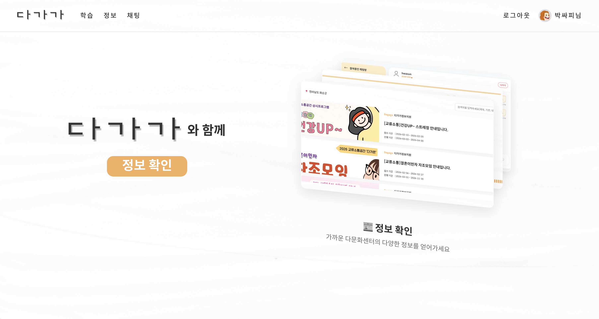
.png)
2.  **[목록 확인]** 내 거주 지역(예: 전라남도 화순군) 기반의 관공서 소식, 프로그램 정보 등이 표시됨을 확인
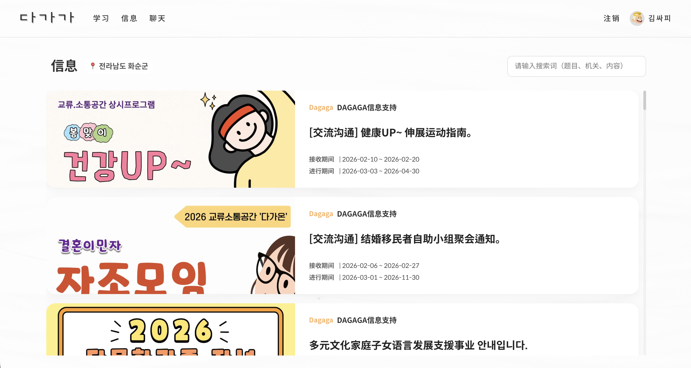
.png)
3.  **[상세 보기]** 관심 있는 게시글 클릭하여 상세 내용 확인
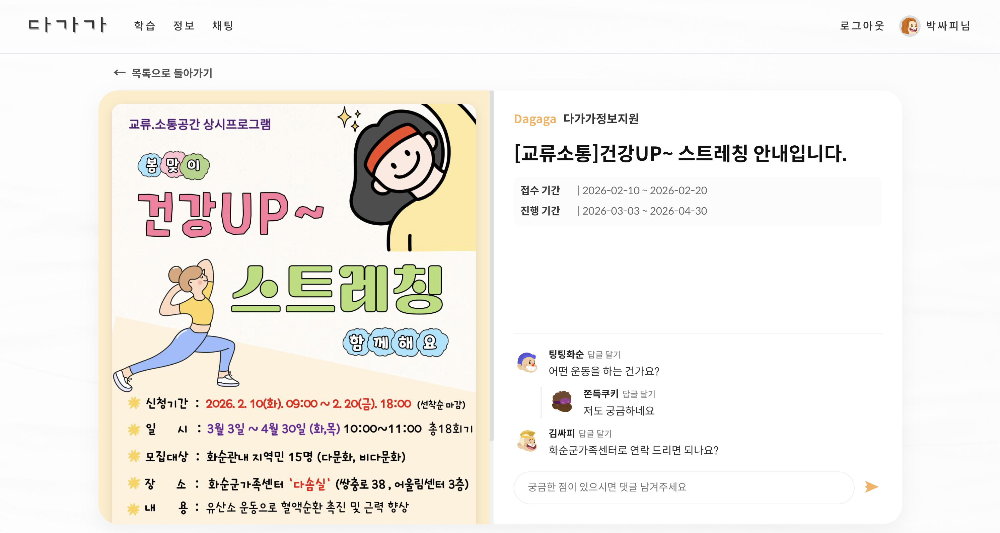
.png)
4.  **[댓글 작성]**
    *   하단 댓글창에 댓글 입력 후 오른쪽의 댓글 등록 버튼 클릭
    *   작성한 댓글이 실시간으로 등록되는지 확인
    *   다른 사용자의 댓글에 **'답글 달기'** 버튼을 눌러 대댓글 작성
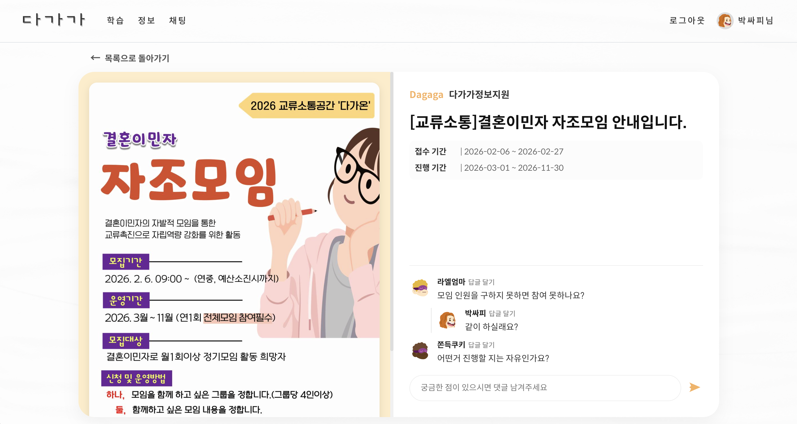
.png)

## 다국어 실시간 채팅방
1.  **[메인화면]** 상단 네비게이션바에서 **'채팅'** 탭 클릭
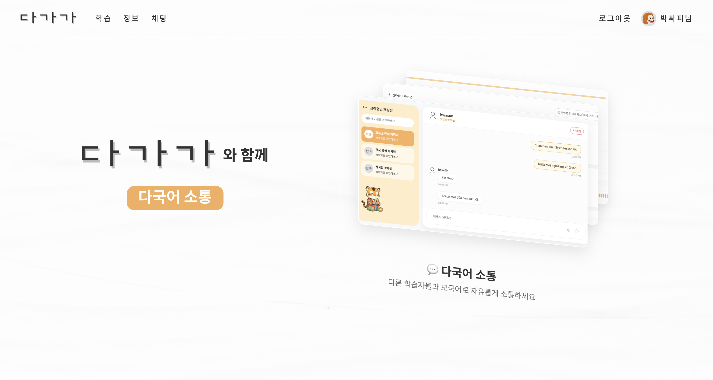
.png)
2.  **[목록 확인]** 내 거주 지역(예: 전라남도 화순군) 기반의 채팅방 목록과 현재 참여 중인 채팅방 목록이 표시됨을 확인
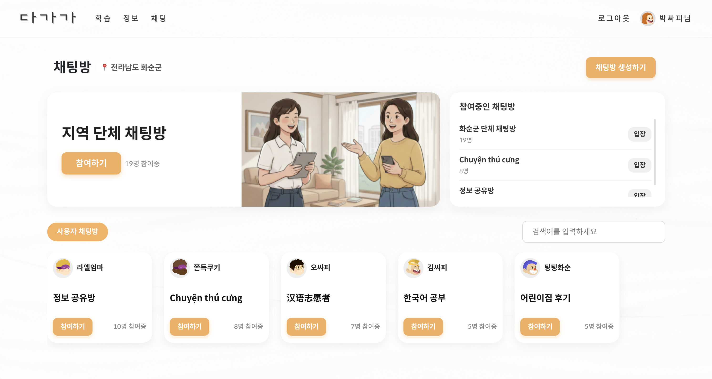
.png)
3.  **[입장]** 오른쪽 '참여중인 채팅방 목록'에서 '화순군 지역 채팅방' 오른쪽의 '클릭' 버튼을 클릭하여 입장
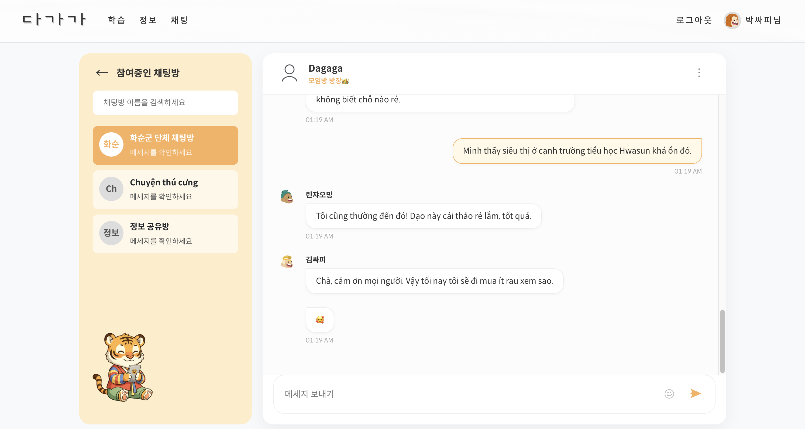
.png)
4.  **[메시지 전송 - 죽국어]**
    *   입력창에 **"你好，我这次刚搬过来！"** 입력 후 전송 (사용자 2)
    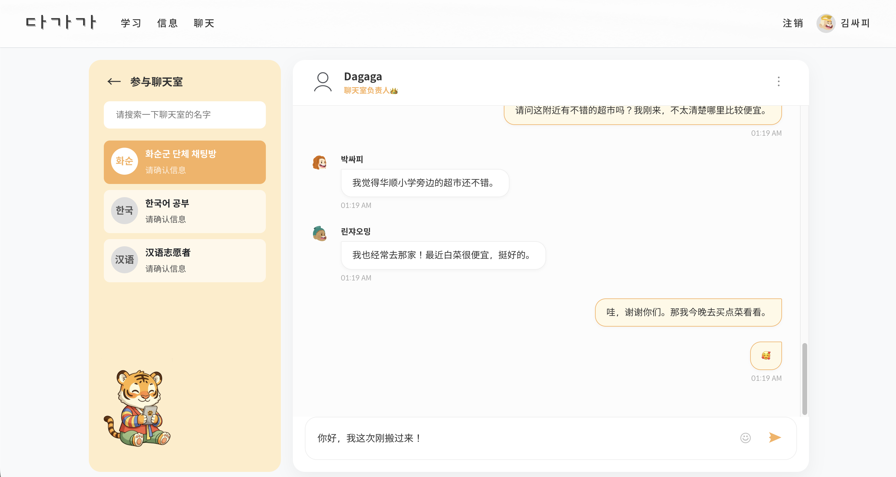
5. **[메시지 확인]**
    *   화면에 내 메시지가 내가 보낸 언어로 표시됨을 확인 (사용자 2)
    .png)
    *   해당 채팅방에 참여중인 다른 사용자의 화면에 메시지가 번역된 언어로 표시됨을 확인 (사용자 1)
    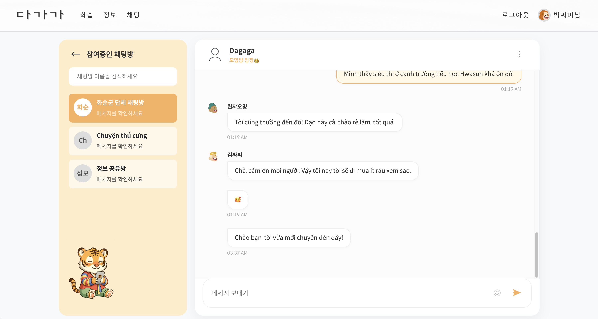

## 한국어 발음 학습
1.  **[메인화면]** 상단 네비게이션바에서 **'학습'** 탭 클릭
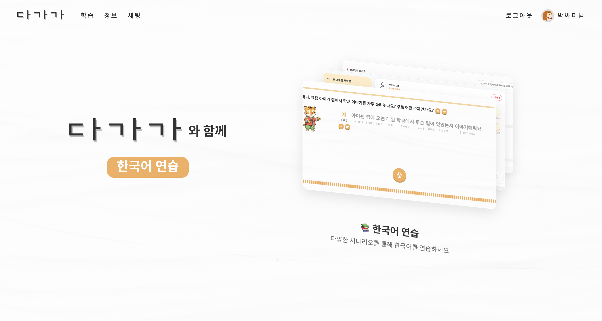

### 예시 학습 ver
2.  **[시나리오 선택]** '학업', '자기소개', '의료' 중 원하는 시나리오 카드 선택 (예시: 학업)
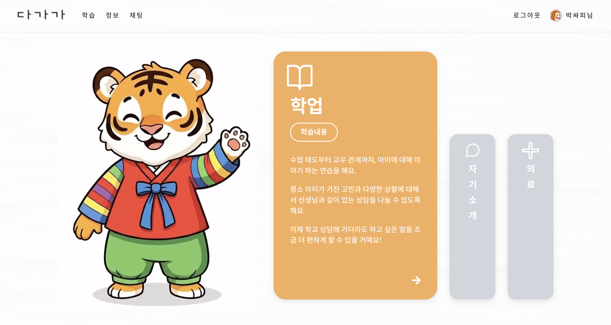
3.  **[문제 선택]** 질문을 보며 원하는 문제 선택 (예시: 문제 3 → '예시' 클릭)
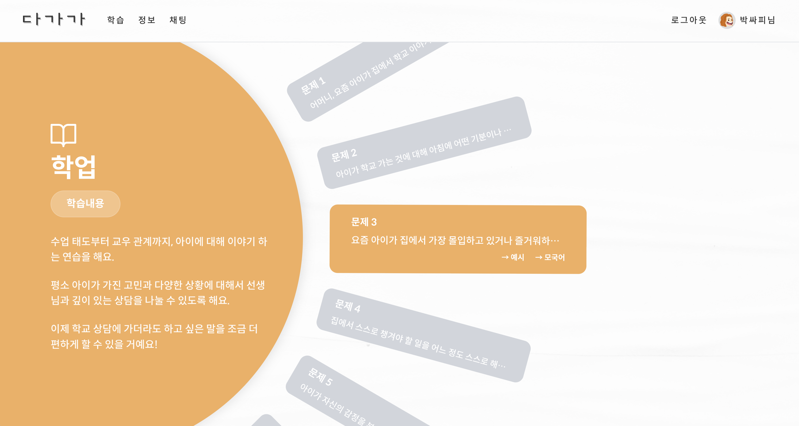
4.  **[학습 진행]** 끊어읽기 진행 후 한 문장 읽기 진행
    *   **듣기**: 원어민 발음(TTS) 듣기
    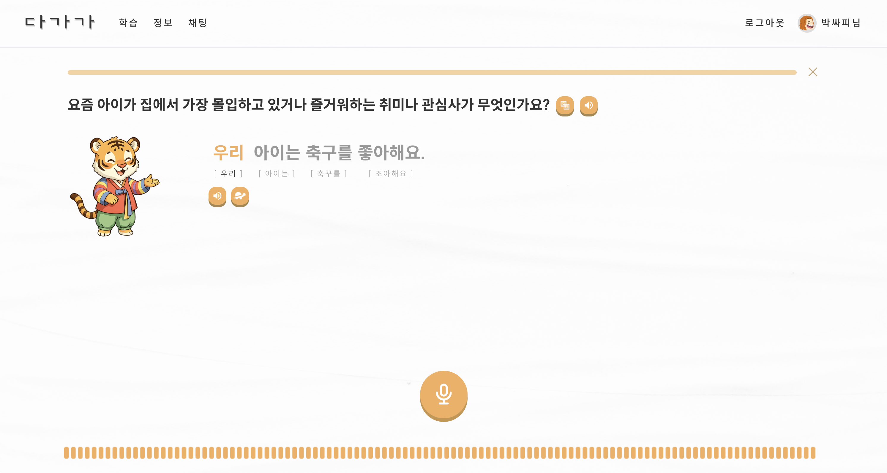
    *   **따라하기**: 마이크 버튼을 누르고 문장 읽기 (녹음)
    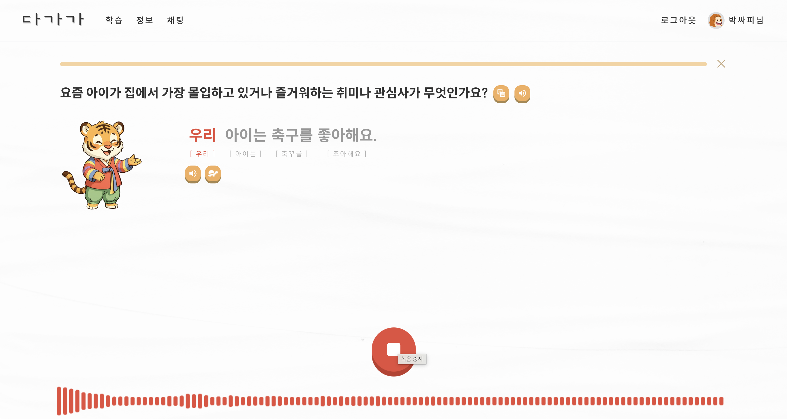
    *   **AI 평가**: 발음 정확도에 따라 O/X 피드백 및 다시 시도 기능 확인
    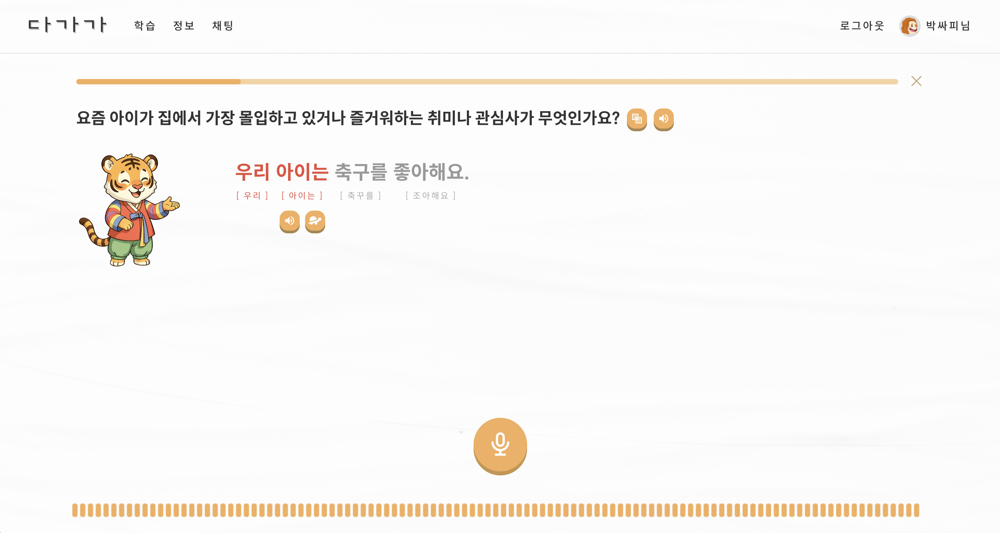
4.  **[완료]** 학습 완료 후 마스코트(호랑이)의 격려 메시지 확인

### 모국어 학습
2.  **[시나리오 선택]** '학업', '자기소개', '의료' 중 원하는 시나리오 카드 선택 (예시: 의료)
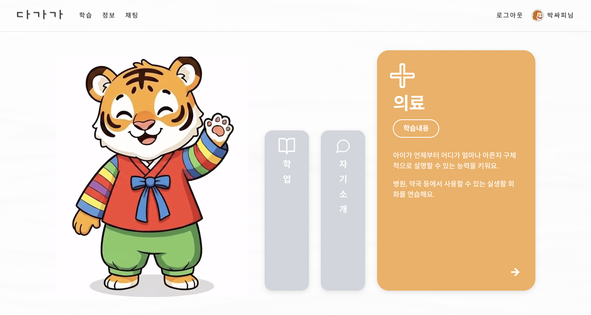
3.  **[문제 선택]** 질문을 보며 원하는 문제 선택 (예시: 문제 3 → '모국어' 클릭)

4.  **[학습 진행]** 모국어로 답변 발화 후 번역된 한국어 문장 학습 진행 (학습 순서는 예시 ver과 동일)
    *   **질문 듣기**
    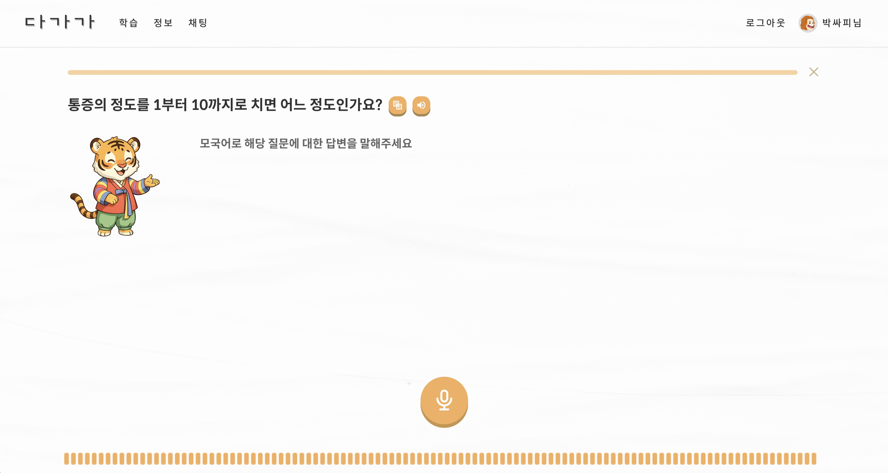
    *   **모국어로 답변하기**: 마이크 버튼을 누르고 답변 말하기
    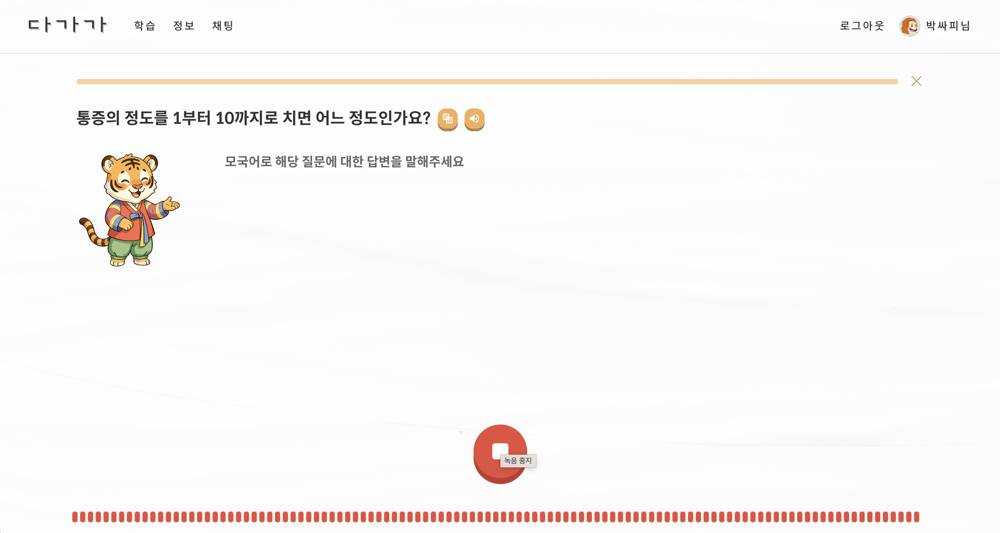
    *   **번역된 한국어 문장 학습하기** (이후 진행은 예시 ver과 동일)
    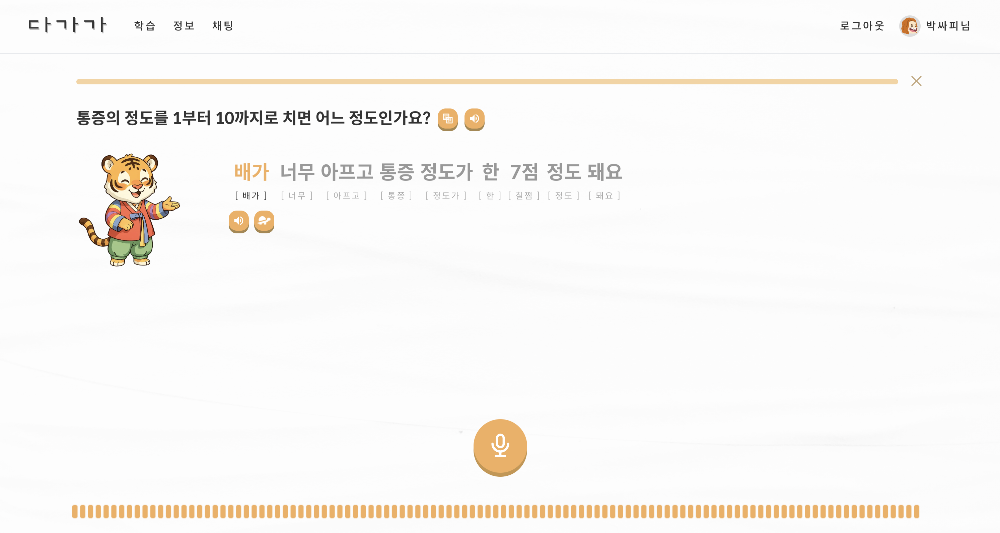

---
