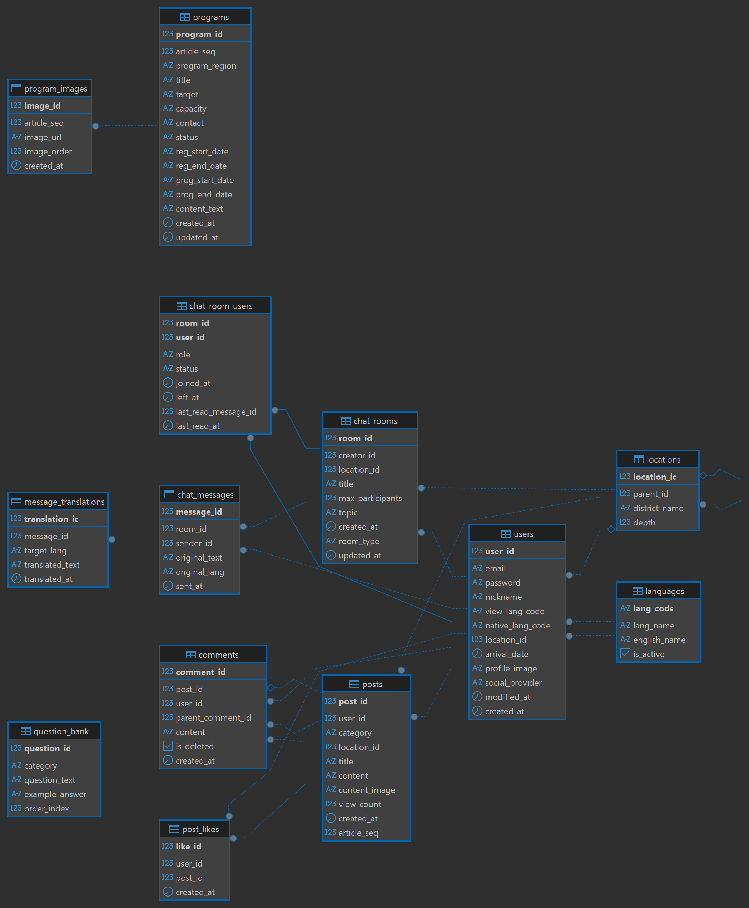
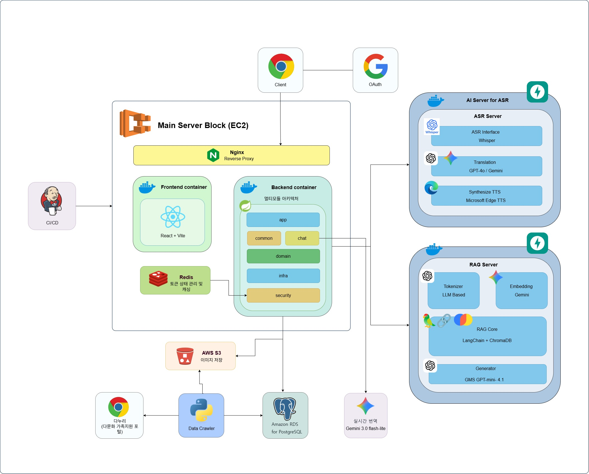

# Dagaga (다가가)

## 다문화 가정 학부모를 위한 한국어 발화 자신감 향상 플랫폼
"완벽하지 않아도 괜찮아요, 입 밖으로 소리 내어 말하는 연습부터 시작하세요!"
> 본 프로젝트는 한국어 소통에 두려움을 느끼는 다문화 가정 학부모들이 일상 속 핵심 상황에서 자신 있게 말할 수 있도록 돕는 생성형 AI 기반 쉐도잉 및 커뮤니티 플랫폼입니다.

## 💡 프로젝트 개요 (Project Overview)
다문화 가정의 학부모들은 자녀의 학교 상담, 병원 방문 등 중요한 순간에 문법적 완벽함에 대한 부담감으로 인해 입을 떼는 데 어려움을 겪습니다.

우리는 정확도 위주의 평가보다는 발화 자체의 자신감에 집중하며, 사용자가 실제 하고 싶은 말을 즉시 학습 스크립트로 변환해 주는 맞춤형 서비스를 제공합니다.

### 🎯 핵심 타겟
- 한국어 소통에 심리적 장벽을 느끼는 다문화 가정 부모

- 취학 전/후 자녀를 두어 학교 및 공공기관과의 소통이 빈번한 학부모

- 거주 지역 내 다문화 혜택 및 육아 정보를 얻고자 하는 사용자

- 같은 환경의 다문화 기반 커뮤니티를 만들고 새로운 사람들을 만나고 싶은 사용자


## ✨ 핵심 기능 (Key Features)
### 🎙️ A. 학습 기능 (Core Shadowing)
LLM을 활용하여 개인화된 스크립트를 생성하고 단계별 학습을 지원합니다.

## 1. 상황별 맞춤 시나리오 학습


    - 학교, 병원 등 카테고리별 실전 대화문 생성 (LLM 기반).

    - 3-Step 학습 프로세스:

        - Listen: TTS를 통한 원어민 발음 청취.

        - Chunking: 의미 단위로 쪼개어 끊어 읽기.

        - Shadowing: 전체 문장 따라 읽기.


## 2. "하고 싶은 말" 맞춤 변환


    - 모국어(베트남어, 중국어 등)로 입력한 내용을 상황(정중함/친근함)에 맞는 한국어 문장으로 즉시 변환.


### 🤝 B. 커뮤니티 기능 (Community)
정보 비대칭을 해소하고 심리적 유대감을 형성합니다.

## 1. 지역 기반 생활 정보 (Local Info)

    - 지자체 다문화 지원 센터 공지사항 연동.

    - 동네 기반 생활 밀착형 정보 공유 (예: "대전 유성구 다문화 이벤트").

## 2. 다국어 지원 및 자동 번역

    - 플랫폼 내 모든 게시글을 사용자의 화면 표시 언어로 실시간 번역하여 원활한 소통 지원.
    - 실시간 채팅 번역을 통한 다문화 가정간의 언어 장벽 완화.

<sub>전체 시연에 대한 작동 영상은 [google drive](https://drive.google.com/drive/folders/1P0BcXf7JqGVToW8msQGJvotVd0-G04n1?hl=ko)에 공유되어 있습니다.</sub>

## 🛠 기술 스택 (Tech Stack)
- Language: Java, Python

- AI/LLM: Gemini Flash 2.5, Whisper-small(FineTuned based on G2P Layer, STT), Edge TTS

- Audio/Voice: Text-to-Speech (TTS), Web Speech API (STT)

- Frontend: React

- Backend: Spring Boot / FastAPI

- Database: PostgreSQL

- Cloud: AWS

- CI/CD: Jenkins / Doker

## 📂 프로젝트 구조 (Architecture)
```Plaintext

├── client (Web)
│   ├── components (Learning, Community)
│   └── hooks (Voice Recording, Translation)
├── server (API)
│   ├── api (LLM Prompts, Translation Logic)
│   └── models (User Data, Custom Scripts)
└── crawler (Public Data)
    └── scripts (Multi-cultural Center Info)
```

## 🚀 기대 효과
- 심리적 장벽 완화: 반복적인 쉐도잉을 통해 '말하기에 대한 두려움' 해소.

- 사회적 통합 지원: 실생활에 필요한 언어 능력을 확보하여 원활한 사회 참여 독려.

- 정보 격차 해소: 지역 맞춤형 정보 공유를 통해 다문화 가정의 고립 방지.

## ERD


## 요구사항 명세서


## 아키텍처 로드맵

