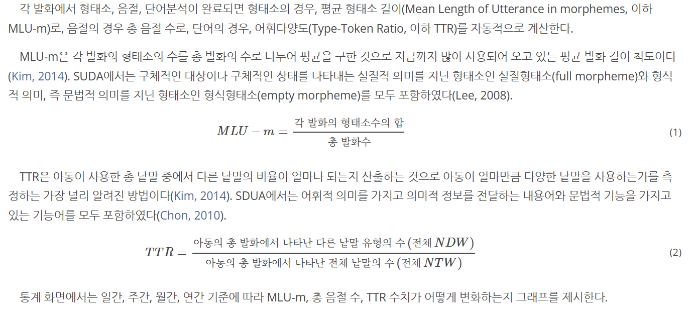

# MLU-m과 TTR 개념 정리 문서

## 1. 개요

아동 언어 분석 및 발화 분석에서는 발화의 길이, 구조적 복잡성, 어휘 다양성을 정량적으로 측정하기 위한 지표가 필요하다.  
이때 가장 널리 사용되는 대표적인 지표가 **MLU-m (Mean Length of Utterance in morphemes)**과  
**TTR (Type-Token Ratio)**이다.

본 문서는 형태소·음절·단어 분석이 완료된 발화 데이터를 기반으로  
MLU-m과 TTR의 개념, 계산 방식, 해석 방법을 체계적으로 정리한다.

---

## 2. MLU-m (Mean Length of Utterance in Morphemes)

### 2.1 정의

MLU-m은 발화 1개당 평균 형태소 수를 의미하며,  
아동의 문법적 발달 수준과 발화 구조의 복잡성을 측정하는 대표적인 지표이다.

---

### 2.2 계산 목적

- 아동 언어 발달 단계 평가
- 문법적 복잡성 비교
- 평균 발화 길이 분석

---

### 2.3 계산 방법

#### 공식

```
MLU-m = 각 발화의 형태소 수의 합 / 총 발화 수
```

---

### 2.4 형태소 계산 기준

MLU-m 계산 시 다음 형태소를 모두 포함한다.

- **실질형태소 (Full morpheme)**  
  의미를 직접 전달하는 형태소 (명사, 동사 어간 등)

- **형식형태소 (Empty morpheme)**  
  문법적 기능을 담당하는 형태소 (조사, 어미 등)

---

### 2.5 해석 방법

- MLU-m 값이 높을수록 발화가 길고 문법 구조가 복잡함
- 값이 낮을수록 단순한 문장 위주의 발화

---

### 2.6 장점과 한계

**장점**

- 언어 발달 평가에서 높은 신뢰도
- 다양한 연구에서 표준 지표로 사용

**한계**

- 발화 수가 적을 경우 평균 왜곡 가능

---

## 3. TTR (Type-Token Ratio)

### 3.1 정의

TTR은 전체 단어(Token) 중 서로 다른 단어(Type)의 비율로,  
어휘 다양성을 측정하는 지표이다.

---

### 3.2 계산 목적

- 어휘 사용의 다양성 평가
- 반복 단어 사용 정도 파악

---

### 3.3 계산 방법

#### 공식

```
TTR = NDW / NTW
```

- NDW: 서로 다른 단어의 수
- NTW: 전체 단어 수

---

### 3.4 단어 범위 기준

- 의미를 전달하는 내용어
- 문법적 기능을 수행하는 기능어  
  → 두 범주 모두 포함하여 계산

---

### 3.5 해석 방법

- TTR이 높을수록 다양한 단어 사용
- TTR이 낮을수록 동일 단어 반복 사용

---

### 3.6 장점과 한계

**장점**

- 계산이 단순하고 직관적

**한계**

- 발화 길이에 매우 민감
- 서로 다른 샘플 길이 간 직접 비교 어려움

---

## 4. MLU-m과 TTR 비교

| 항목      | MLU-m         | TTR          |
| --------- | ------------- | ------------ |
| 측정 대상 | 문법적 길이   | 어휘 다양성  |
| 분석 단위 | 형태소        | 단어         |
| 주요 의미 | 구조적 복잡성 | 어휘 사용 폭 |

---

## 5. 활용

- 일/주/월/연 단위 언어 발달 변화 분석
- 중재 전·후 비교
- 개인별 언어 성장 추적

---

## 6. 정리

MLU-m과 TTR은 각각 문법 발달과 어휘 발달을 설명하는 지표로,  
두 지표를 함께 활용할 때 언어 특성을 보다 입체적으로 분석할 수 있다.

## 7. 참고


